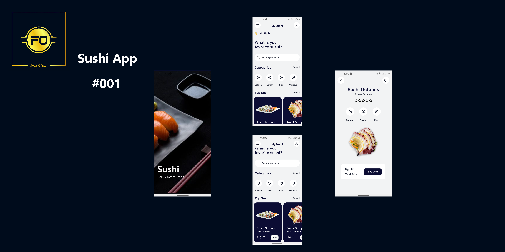

# Sushi-App

This is a React Native (Cross-Platform) Sushi App for a modern-day restaurant!

The Main Screens are

Tech Stack Used:
1. `Expo`
2. `Typescript`

To Run in your local environment:

1. Clone the repo
2.In your terminal, run `yarn install`
3. Run `yarn start`
4. Scan the QR Code with Expo App

`Built&CodedByFelixOduor`

Happy Coding!
